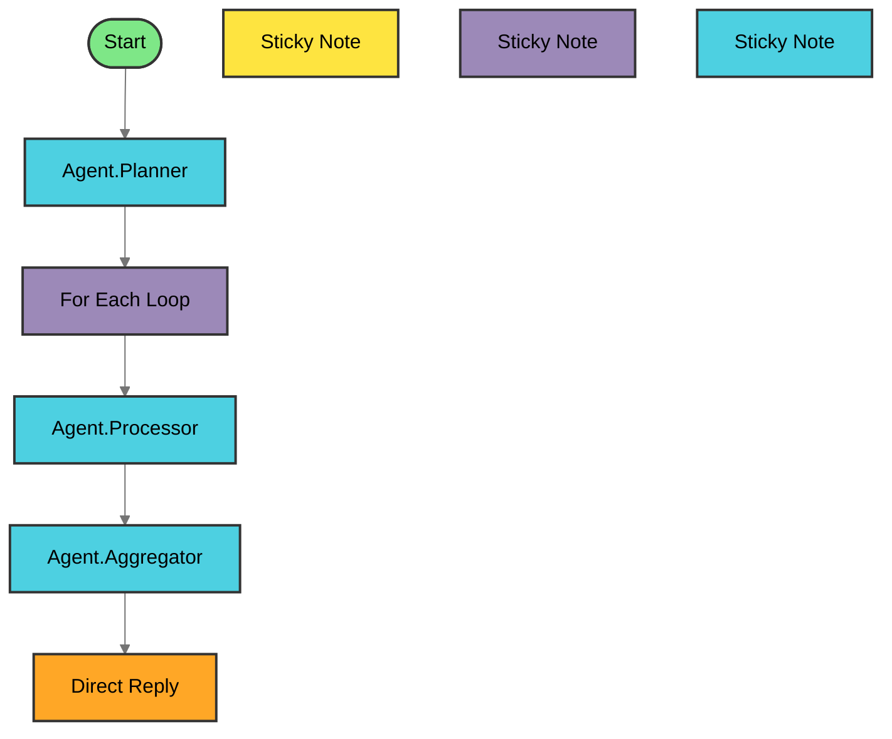

# AFv2 Pattern #7: Batch Processing (Iteration Node)

**Flowise AgentFlow v2 Pattern Template**

Demonstrates batch/array processing using the Iteration Node for for-each loop operations.

---

## 📊 Workflow Architecture

**[View Full Workflow Diagram →](./WORKFLOW-DIAGRAM.md)**



    

---

**Total Nodes**: 9 |
**Agents**: 3 |
**Complexity**: Complex

<details>
<summary><b>🔍 View Agent Details (Click to Expand)</b></summary>

| Agent | Type | Description |
|-------|------|-------------|
| 🚀 Start | Start | Starting point of the agentflow |
| 📝 Sticky Note | StickyNote | Add notes to the agent flow |
| 🤖 Agent.Planner | Agent | Dynamically choose and utilize tools during run... |
| 📝 Sticky Note | StickyNote | Add notes to the agent flow |
| 🔁 For Each Loop | Iteration | Execute the nodes within the iteration block fo... |
| 🤖 Agent.Processor | Agent | Dynamically choose and utilize tools during run... |
| 📝 Sticky Note | StickyNote | Add notes to the agent flow |
| 🤖 Agent.Aggregator | Agent | Dynamically choose and utilize tools during run... |
| 💭 Direct Reply | DirectReply | Reply directly without agent processing |

</details>


### 🎨 Node Type Legend

| Icon | Type | Description |
|------|------|-------------|
| 🚀 | Start | Entry point of the workflow |
| 🤖 | Agent | AI agent with reasoning capabilities |
| 💬 | LLM | Large Language Model node |
| 🔀 | Condition | Branching logic |
| 🎯 | ConditionAgent | AI-powered conditional routing |
| 🔧 | Tool | External tool integration |
| ▶️ | ExecuteFlow | Execute another workflow |
| ⚙️ | CustomFunction | Custom JavaScript function |
| 🌐 | HTTP | HTTP request node |
| 👤 | HumanInput | Request human input/approval |
| 💭 | DirectReply | Direct message response |
| 🔄 | Loop | Loop back to previous node |
| 🔁 | Iteration | Iterate over array |
| 📝 | StickyNote | Documentation note |

---

## Pattern Overview

This template implements a batch processing workflow where a single agent processes multiple array elements sequentially. The Processor agent executes N times (once per item), and an Aggregator collects results and computes statistics.

### Flow Structure

```
Start → Planner → Iteration Node → Processor (N executions) → Aggregator → Direct Reply
```

**Key Innovation**: Iteration-based parallel processing where one agent handles all items in the array rather than routing to different specialized agents.

---

## Features

✅ **For-Each Iteration**: Process arrays with automatic looping
✅ **Batch Statistics**: Aggregate success/failure counts and metrics
✅ **Flexible Operations**: Sentiment analysis, validation, transformation, etc.
✅ **Error Handling**: Track individual item successes and failures
✅ **Flow State Management**: Maintain batch state throughout workflow

---

## Use Cases

- **Bulk Sentiment Analysis**: Analyze 5+ customer reviews
- **Batch Data Validation**: Check multiple records for compliance
- **Multi-Document Processing**: Summarize 10+ PDFs in one request
- **List Transformation**: Convert arrays of data (e.g., CSV rows)

---

## Node Architecture

### 9 Nodes Total

1. **Start Node** - Chat input for batch requests
2. **Planner Agent** - Extracts/validates array, stores in Flow State
3. **Iteration Node** - For-each loop over `$flow.state.items`
4. **Processor Agent** - Executes once per array element (N times)
5. **Aggregator Agent** - Collects results, computes statistics
6. **Direct Reply Terminal** - Outputs batch summary
7-9. **Sticky Notes** - Documentation (Purpose, Iteration Logic, Aggregation)

---

## Installation

### Prerequisites

- Flowise v1.8.0+ (with AgentFlow v2 support)
- Claude Sonnet 4.5 API key
- Custom tools configured:
  - `currentDateTime` (temporal context)
  - `searxng-search` (real-time web search)

### Import Workflow

1. Download `07-batch-processing.json`
2. Open Flowise UI
3. Click **"Import Workflow"**
4. Upload the JSON file
5. Configure credentials:
   - Add "Anthropic API Key" credential
6. Save and test

Full instructions: See [INTEGRATION_GUIDE.md](./INTEGRATION_GUIDE.md)

---

## Usage

### Example 1: Sentiment Analysis (5 Reviews)

**Input:**
```
Analyze sentiment for these 5 customer reviews:
1. "Amazing product! Highly recommend!"
2. "Terrible quality, broke after 2 days"
3. "Good value for money"
4. "Not bad but could be better"
5. "Absolutely love it!"
```

**Output:**
```
Batch processing complete. Analyzed 5 items with 100% success rate.
Sentiment breakdown: 3 positive, 1 negative, 1 neutral.
Average confidence: 0.92
```

### Example 2: Batch Data Validation

**Input:**
```
Validate these email addresses:
- user@example.com
- invalid-email
- admin@company.org
- test@
```

**Output:**
```
Batch processing complete. Validated 4 items.
Success: 2, Failures: 2
Valid emails: user@example.com, admin@company.org
Invalid: invalid-email (missing @domain), test@ (incomplete domain)
```

---

## Flow State Schema

The workflow maintains this state structure:

```json
{
  "raw_input": "string - original user request",
  "items": "array - list of items to process",
  "processed_count": "number",
  "success_count": "number",
  "failure_count": "number",
  "iteration_results": "array - full results from each iteration",
  "batch_summary": {
    "positive": "number",
    "negative": "number",
    "neutral": "number",
    "average_confidence": "number",
    "message": "string - human-readable summary"
  }
}
```

---

## Agent Specifications

### Planner Agent
- **Role**: Extract and validate array of items
- **Model**: Claude Sonnet 4.5
- **Tools**: currentDateTime, searXNG
- **Output**: Structured array in Flow State (`$flow.state.items`)

### Processor Agent
- **Role**: Process single item (executes N times via iteration)
- **Model**: Claude Sonnet 4.5
- **Tools**: currentDateTime, searXNG
- **Input**: `{{ $iteration.current }}` (single item)
- **Output**: Structured result with success indicator

### Aggregator Agent
- **Role**: Collect all iteration results and compute statistics
- **Model**: Claude Sonnet 4.5
- **Tools**: currentDateTime, searXNG
- **Input**: `{{ $iteration.results }}` (array of all results)
- **Output**: Summary statistics and human-readable message

---

## Testing

### Quick Test

1. Import workflow into Flowise
2. Start a chat session
3. Send: "Analyze sentiment: ['Great!', 'Terrible', 'Okay']"
4. Verify:
   - Planner extracts 3 items
   - Processor executes 3 times
   - Aggregator shows: 1 positive, 1 negative, 1 neutral

### Validation

Run structure validator:
```bash
python3 /Users/name/homelab/context-foundry/extensions/flowise/validate_workflow.py 07-batch-processing.json
```

Expected: ✅ All 13 patterns pass

---

## Project Structure

```
afv2-pattern-07-batch/
├── 07-batch-processing.json   # Complete Flowise workflow (9 nodes)
├── README.md                    # This file
├── INTEGRATION_GUIDE.md         # Detailed import instructions
└── .context-foundry/            # Build artifacts
    ├── scout-report.md
    ├── architecture.md
    └── session-summary.json
```

---

## Technologies

- **Platform**: Flowise AgentFlow v2
- **Model**: Claude Sonnet 4.5 (`claude-sonnet-4-5-20250929`)
- **Tools**: currentDateTime, searXNG
- **Node Types**: Start, Agent, Iteration, Direct Reply, Sticky Notes

---

## Configuration Standards

All agents follow these standards:
- **Model**: `claude-sonnet-4-5-20250929`
- **Credential**: `"Anthropic API Key"`
- **agentMessages**: `""` (empty string)
- **Memory**: Enabled (`agentEnableMemory: true`)
- **Tools**: Nested `agentSelectedToolConfig` (Pattern #6 compliant)

---

## Troubleshooting

### Issue: "Iteration Node not found"
- **Cause**: Flowise version < 1.8.0 (Iteration Node added in v1.8+)
- **Solution**: Upgrade Flowise to latest version

### Issue: "Flow State variables not resolving"
- **Cause**: Incorrect variable syntax
- **Solution**: Use `{{ $flow.state.items }}` (NOT `$flow.items` or `{{ flow.state.items }}`)

### Issue: "Processor agent not executing"
- **Cause**: Edge not connected to Iteration Node output
- **Solution**: Verify edge from `iterationAgentflow_0-output` to `agent_processor-input`

---

## Related Patterns

- **Pattern #1 (Chaining)**: Sequential 3-step pipeline
- **Pattern #2 (Parallel)**: Multi-source concurrent execution
- **Pattern #4 (Iteration)**: Quality improvement loop with convergence

See `/Users/name/homelab/context-foundry/extensions/flowise/templates/afv2-patterns/` for all 6 patterns.

---

## Contributing

This pattern is part of the Context Foundry AFv2 Pattern Library. To suggest improvements:

1. Test modifications in Flowise UI
2. Export updated JSON
3. Validate with `validate_workflow.py`
4. Submit changes with test results

---

## License

MIT License - Part of Context Foundry project

---

## Credits

🤖 Built autonomously by [Context Foundry](https://contextfoundry.dev)

**Pattern Type**: Iteration-based batch processing
**Template Version**: 1.0
**Last Updated**: 2025-01-19
