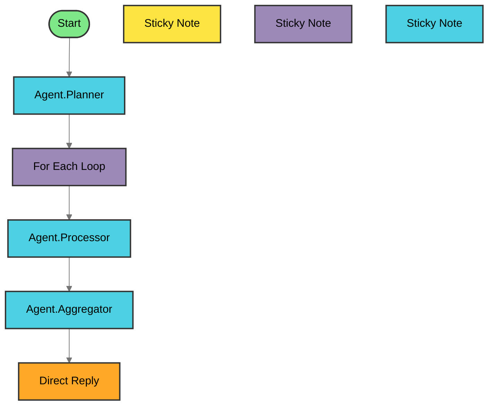

    

---

**Total Nodes**: 9 | 
**Agents**: 3 | 
**Complexity**: Complex

<b>🔍 View Agent Details (Click to Expand)</b>

| Agent | Type | Description |
|-------|------|-------------|
| 🚀 Start | Start | Starting point of the agentflow |
| 📝 Sticky Note | StickyNote | Add notes to the agent flow |
| 🤖 Agent.Planner | Agent | Dynamically choose and utilize tools during run... |
| 📝 Sticky Note | StickyNote | Add notes to the agent flow |
| 🔁 For Each Loop | Iteration | Execute the nodes within the iteration block fo... |
| 🤖 Agent.Processor | Agent | Dynamically choose and utilize tools during run... |
| 📝 Sticky Note | StickyNote | Add notes to the agent flow |
| 🤖 Agent.Aggregator | Agent | Dynamically choose and utilize tools during run... |
| 💭 Direct Reply | DirectReply | Reply directly without agent processing |

### 🎨 Node Type Legend

| Icon | Type | Description |
|------|------|-------------|
| 🚀 | Start | Entry point of the workflow |
| 🤖 | Agent | AI agent with reasoning capabilities |
| 💬 | LLM | Large Language Model node |
| 🔀 | Condition | Branching logic |
| 🎯 | ConditionAgent | AI-powered conditional routing |
| 🔧 | Tool | External tool integration |
| ▶️ | ExecuteFlow | Execute another workflow |
| ⚙️ | CustomFunction | Custom JavaScript function |
| 🌐 | HTTP | HTTP request node |
| 👤 | HumanInput | Request human input/approval |
| 💭 | DirectReply | Direct message response |
| 🔄 | Loop | Loop back to previous node |
| 🔁 | Iteration | Iterate over array |
| 📝 | StickyNote | Documentation note |
